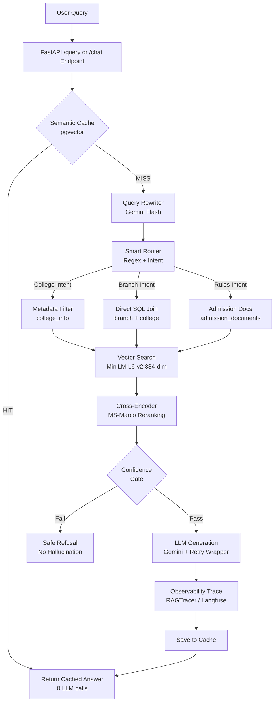

# 🎓 TNEA Counselor AI

> A **production-grade AI Engineering College Counselor** for Tamil Nadu students, powered by **RAG (Retrieval-Augmented Generation)** with Hybrid Search, SSE Streaming, Conversational Memory, and Enterprise Guardrails.

Built to handle **418 Colleges**, **3,516 Departments/Branches**, and **Official TNEA Admission Rules** with zero hallucinations. Battle-tested against an automated regression suite with **0 server failures**.


---

## 🚀 Key Features

- 🎯 **Smart Intent Routing** — Routes queries to College, Branch, or Admission data silos using strict Regex word boundaries (prevents "ec" matching "technology")
- 🔗 **Hybrid Search with SQL Joins** — Combines pgvector Vector Search + Relational SQL joins to enrich branch records with college names and districts
- 🌊 **SSE Token Streaming** — The `/chat` endpoint streams the answer token-by-token over Server-Sent Events, followed by a citation-card payload
- 🔍 **Universal Multi-Stage Entity Resolver** — Automatically parses and resolves all 418+ TNEA institutions without manual aliases. Handles compound words (`sairam` ↔ `sai ram`), missing prefixes (`Sri`, `Dr.`), spelling quirks (`Enginering`), multi-campus district disambiguation (e.g. *Velammal in Madurai* vs *Velammal in Chennai*), and fuzzy brand matching ($\ge 0.80$)
- 🛡️ **Zero False Refusals** — Guaranteed routing that prevents course/branch questions (e.g. Marine Engineering, Aerospace, Robotics), category questions, or conversational inquiries from ever being falsely rejected as nonexistent colleges
- ⚡ **Semantic Caching** — Instant responses for repeated questions (0 LLM calls), with admin purge + user downvote self-healing
- 🛡️ **Anti-Hallucination Guardrails** — Confidence gates (Rerank logit + Vector similarity thresholds) block low-confidence generations before the LLM is called
- 🤖 **Universal Retry Wrapper** — Exponential backoff across a Gemini fallback chain survives 429 rate limits without crashing (0 HTTP 500s)
- 🚦 **Rate Limiting** — `slowapi`-backed limiter (10 requests/minute per IP) protects the `/chat` endpoint from abuse
- 🔭 **Observability** — Structured JSON tracing of query → retrieved chunks → prompt → answer → latency, with optional Langfuse export
- 🧪 **42-Case Regression Suite** — Automated testing for SQL injection, Unicode/Tamil input, emoji, 3KB payloads, top_k bounds, filters, and concurrency bursts
- 👍 **User Feedback Loop** — "Thumbs Down" endpoint deletes poisoned cache entries on demand
- 🔧 **Admin Cache Management** — Secret-protected purge endpoint (403 on wrong key) for yearly data updates

---

## 🛠️ Tech Stack

| Component | Technology | Purpose |
|-----------|------------|---------|
| **Backend Framework** | FastAPI + Pydantic | Production REST API with request validation (`top_k` clamped 1–20), global exception handling, and a 60s request timeout middleware |
| **Rate Limiting** | slowapi | 10 req/min per-IP limiter on the streaming `/chat` endpoint |
| **Vector Database** | Supabase + pgvector | Vector storage + `match_documents` RPC similarity search |
| **LLM** | Google Gemini Flash (fallback chain) | Answer generation, intent classification, query rewriting |
| **Embeddings** | `sentence-transformers/all-MiniLM-L6-v2` (384-dim) | Runtime embedding model used by the live API for query & document vectors, optimized to fit 512MB free-tier RAM |
| **Reranker** | `cross-encoder/ms-marco-MiniLM-L-6-v2` | Cross-Encoder relevance scoring + confidence gate |
| **Observability** | Custom `RAGTracer` + optional Langfuse | Structured trace logging of the full retrieval → generation pipeline |
| **Package Manager** | uv (dev) / pip (Docker & Render) | `pyproject.toml` + `uv.lock` for local dev; `requirements.txt` for container builds |
| **Deployment** | Render (Free Tier) / Docker / Hugging Face Spaces | Cloud hosting with CPU-only PyTorch build |

> ⚠️ **Note:** The `Dockerfile` currently pre-downloads `BAAI/bge-large-en-v1.5` during the image build to warm the model cache. The live API (`app/services/retrieval.py`) actually loads and serves `all-MiniLM-L6-v2` at runtime. Older one-off ingestion scripts (`02_ingest_colleges.py`, `04_ingest_performance.py`, `05_ingest_admission_info.py`) also still reference `bge-large-en-v1.5` from an earlier iteration, while the current production ingestion path (`08_master_ingest.py`, `09_reingest_minilm.py`) uses `all-MiniLM-L6-v2` to match the API's 384-dim vectors. Worth reconciling so the Dockerfile doesn't download an unused model.

---

## 🏗️ System Architecture



---

## 📁 Project Structure

```text
tnea-ai-counselor/
├── app/
│   ├── main.py                    # FastAPI app: CORS, timeout middleware, lifespan, all endpoints
│   ├── config.py                  # pydantic-settings config (env vars, Render vs local detection)
│   ├── models.py                  # Pydantic schemas (QueryRequest, QueryResponse, Source)
│   └── services/
│       ├── retrieval.py           # Hybrid Search, Fuzzy Matching, SQL Joins, model loading
│       ├── llm.py                 # Gemini generation (streaming + non-streaming) with fallback chain
│       ├── query_understanding.py # Intent extraction + history-aware query rewriting
│       ├── memory.py              # Conversational history management
│       ├── semantic_cache.py      # pgvector semantic caching + guardrails
│       ├── observability.py       # RAGTracer: structured tracing + optional Langfuse export
│       └── database.py            # Supabase client initialization
├── data/
│   ├── raw/                       # Source datasets: colleges_db_df.csv, college_branches_rows.csv (3,516 rows), performance_db_df.csv, tnea_admission_info.json
│   └── processed/                 # Processed rich documents: college_documents, branch_documents, admission_documents
├── scripts/
│   ├── 01_setup_supabase.sql      # Database schema + pgvector RPC functions (updated with department columns)
│   ├── 02_ingest_colleges.py      # (legacy) college ingestion using bge-large-en-v1.5
│   ├── 03_ingest_branches.py      # Ingests college_branches_rows.csv into relational branches table
│   ├── 04_ingest_performance.py   # (legacy) performance data ingestion using bge-large-en-v1.5
│   ├── 05_ingest_admission_info.py# (legacy) admission rules ingestion using bge-large-en-v1.5
│   ├── 06_verify_supabase_data.py # Data health & integrity checker
│   ├── 07_fix_doc_type.py         # One-off doc_type metadata correction
│   ├── 08_master_ingest.py        # Current production ingestion pipeline (all-MiniLM-L6-v2, 384-dim)
│   ├── 09_reingest_minilm.py      # Resume-safe re-ingestion with retry/backoff
│   ├── 09_enrich_and_reingest.py  # Metadata enrichment + re-ingestion pass
│   ├── 10_migrate_branches_schema.sql # Migration script for department_code, department_name, approval_marker
│   ├── 11_edge_case_tests.py      # Automated regression suite
│   ├── evaluate_rag.py            # RAG quality evaluation harness
│   └── preprocess_data.py         # Ingests college_branches_rows.csv & generates denormalized RAG documents
├── tests/
│   ├── test_api.py                # API endpoint tests
│   ├── test_branch_dataset.py     # Unit tests for new branch dataset, schema & retrieval
│   └── test_rag.py                # RAG pipeline unit tests
├── src/rag_final/                 # Packaging entry point (uv build target)
├── .env.example                   # Required environment variables
├── requirements.txt                # CPU-only PyTorch dependencies (used by Docker/Render)
├── pyproject.toml / uv.lock        # uv-managed dependency set for local development
├── Dockerfile                      # Container configuration (port 7860)
├── API_DOCS.md                     # Frontend-facing API reference
├── FRONTEND_INTEGRATION_GUIDE.md   # Detailed frontend integration & SSE guide
└── README.md                       # This file
```

---

## 🏃 Getting Started

### 1. Clone the Repository
```bash
git clone https://github.com/sudhakargovindasamy/tnea-ai-counselor.git
cd tnea-ai-counselor
```

### 2. Install Dependencies

**Option A — uv (recommended for local dev, matches `pyproject.toml`):**
```bash
curl -LsSf https://astral.sh/uv/install.sh | sh
uv venv
source .venv/bin/activate   # Windows: .venv\Scripts\activate
uv sync
```

**Option B — pip (matches Docker/Render build):**
```bash
python -m venv .venv
source .venv/bin/activate   # Windows: .venv\Scripts\activate
pip install -r requirements.txt
```

### 3. Set Up Environment Variables
```bash
cp .env.example .env
nano .env
```

Required variables (see `.env.example` and `app/config.py`):
```env
SUPABASE_URL=https://your-project-url.supabase.co
SUPABASE_KEY=your-supabase-anon-or-service-key
GEMINI_API_KEY=your-gemini-api-key
```

Optional variables:
```env
ADMIN_SECRET_KEY=your-custom-secret        # Defaults to a placeholder if unset — override in production
LANGFUSE_PUBLIC_KEY=your-langfuse-public-key
LANGFUSE_SECRET_KEY=your-langfuse-secret-key
LANGFUSE_HOST=https://cloud.langfuse.com
```

### 4. Ingest Data to Supabase
```bash
# 1. Set up or migrate the schema (includes new department columns)
psql -f scripts/01_setup_supabase.sql   # or run scripts/10_migrate_branches_schema.sql in Supabase SQL editor

# 2. Preprocess raw CSVs into rich denormalized RAG documents
python scripts/preprocess_data.py

# 3. Upload relational branch records (3,516 records from college_branches_rows.csv)
python scripts/03_ingest_branches.py

# 4. Upload colleges and admission rule sets (384-dim vectors)
python scripts/08_master_ingest.py

# 5. Verify data integrity
python scripts/06_verify_supabase_data.py
```

### 5. Run the API
```bash
uvicorn app.main:app --reload --port 8000
```

### 6. Access the API
- **Interactive Docs:** http://localhost:8000/docs
- **Health Check:** http://localhost:8000/health
- **Warmup (pre-load ML models):** http://localhost:8000/warmup

---

## 📡 API Endpoints

| Method | Endpoint | Description |
|--------|----------|-------------|
| `GET`  | `/` | HTML landing page with route links |
| `GET`  | `/health` | System health check + enabled feature flags |
| `GET`  | `/warmup` | Eagerly loads the embedding & reranker models (avoids cold-start latency on first real query) |
| `GET`  | `/search_colleges` | Direct catalog filter search by district, branch code, hostel, and autonomy status |
| `POST` | `/query` | Non-streaming RAG endpoint — returns the full answer + sources in one response |
| `POST` | `/chat` | **SSE-streaming** RAG endpoint (rate-limited, 10/min per IP) — streams answer tokens, then a final sources payload |
| `POST` | `/clear_chat/{session_id}` | Clear conversation history for a session |
| `POST` | `/admin/purge_cache` | Wipe semantic cache (requires `admin_secret` query param, else 403) |
| `POST` | `/feedback/downvote` | Delete poisoned cache entry for a given question |

> Full request/response shapes, score-interpretation guidance, and frontend integration tips live in **[API_DOCS.md](./API_DOCS.md)**.

> 📘 **Frontend developers:** see the **[Frontend Integration Guide](./FRONTEND_INTEGRATION_GUIDE.md)** for exact request/response shapes for every endpoint, a ready-to-use SSE streaming implementation for `/chat`, session-ID handling, and error-handling rules.

### Example Query (`/query`)
```bash
curl -X POST "http://localhost:8000/query" \
  -H "Content-Type: application/json" \
  -d '{
    "session_id": "student_001",
    "question": "Which colleges in Coimbatore offer Computer Science?",
    "top_k": 5
  }'
```

### Example Response Shape
```json
{
  "answer": "The following colleges in Coimbatore offer Computer Science and Engineering...",
  "sources": [
    {
      "college_name": "PSG College of Technology",
      "tnea_code": "2744",
      "district": "Coimbatore",
      "score": 0.9123
    }
  ]
}
```

### Example Streaming Query (`/chat`)
```bash
curl -N -X POST "http://localhost:8000/chat" \
  -H "Content-Type: application/json" \
  -d '{
    "session_id": "student_001",
    "question": "Which colleges in Coimbatore offer Computer Science?",
    "stream": true
  }'
```
Response is a stream of Server-Sent Events:
```
data: {"token": "The"}
data: {"token": " following"}
...
data: {"sources": [{"college_name": "PSG College of Technology", "tnea_code": "2744", "district": "Coimbatore", "score": 0.9123}]}
data: [DONE]
```

---

## 🧪 Testing & Quality Assurance

The system is protected by a **42-case automated regression suite** (`scripts/11_edge_case_tests.py`) that must pass with **0 FAIL** before every deployment, plus unit-level coverage in `tests/`.

```bash
# Unit tests
pytest tests/

# Full regression suite (needs a running server)
# Terminal 1 — start server
uvicorn app.main:app --port 8000

# Terminal 2 — run suite (~10-15 min)
ADMIN_SECRET_KEY=your-secret python scripts/11_edge_case_tests.py
```

### Covered Edge Cases
- **Input Sanitization:** SQL injection payloads, 3KB questions, empty strings, whitespace, emoji, Tamil Unicode, multiline text
- **Validation:** `top_k` bounds enforced by Pydantic (0 / -5 / 100 → clean HTTP 422, never 500)
- **Retrieval Regression:** exact-value answers (mess bill ₹3,200), SQL-join enrichment, source-card completeness
- **Fuzzy Resolution:** typos ("Colege"), aliases ("SSN"), missing spaces ("PSGCollegeofTechnology")
- **Guardrails:** nonexistent colleges, Wi-Fi password requests, gibberish, future cutoffs → safe refusals
- **Memory:** pronoun resolution across turns, `clear_chat` wipe, 10-turn long history
- **Cache & Admin:** cache HIT path, downvote self-healing, wrong-secret 403 rejection
- **Filters:** district normalization (`COIMBATORE` → `Coimbatore`), NBA boolean→string mapping, district+branch intersection
- **Concurrency:** 6 parallel health checks + 3 parallel heavy queries

**Latest result: 42 cases | 34 PASS | 8 WARN (answer-wording reviews) | 0 FAIL ✅**

---

## ☁️ Deployment

### Render (Recommended — Free Tier)
The runtime embedding model (`all-MiniLM-L6-v2`, 384-dim, ~80MB) was deliberately sized so the full stack fits inside Render's **512MB free-tier RAM** while keeping retrieval quality within ~1% of larger models on this structured dataset.

| Setting | Value |
|---------|-------|
| **Runtime** | Python 3 |
| **Build Command** | `pip install -r requirements.txt` |
| **Start Command** | `uvicorn app.main:app --host 0.0.0.0 --port $PORT` |
| **Instance Type** | Free (512MB RAM) |
| **Region** | Singapore (lowest latency to India) |

Environment variables on Render: `SUPABASE_URL`, `SUPABASE_KEY`, `GEMINI_API_KEY`, `ADMIN_SECRET_KEY` (and optionally the `LANGFUSE_*` keys).

> ⚠️ **Cold start note:** Free-tier instances sleep after 15 idle minutes. The first request after sleep takes ~30–45s to reload models; hitting `/warmup` right after wake-up avoids making a real user's first query pay that cost. Subsequent requests run in 2–6s.

### Docker / Hugging Face Spaces
The included `Dockerfile` (CPU-only PyTorch, port 7860) supports any container host, including Hugging Face Spaces (see the front-matter at the top of this file):
```bash
docker build -t tnea-counselor .
docker run -p 7860:7860 --env-file .env tnea-counselor
```

---

## 🤝 Team

This project was developed collaboratively during our internship, with each member owning specific components of the system.

| Member | Role | Key Contributions |
|--------|------|-------------------|
| **Sudhakar** | Backend & AI Architect | Complete RAG pipeline, FastAPI backend, SSE streaming, rate limiting, observability tracing, Supabase pgvector integration, Hybrid SQL Joins, Fuzzy Entity Resolution, 42-case Regression Suite, Universal Retry Wrappers, Render/Docker deployment |
| **Kavivarshini** | AI/ML Engineer | RAG retrieval optimization, MiniLM embedding strategy, query understanding & intent classification, Cross-Encoder reranking, confidence scoring |
| **Poojitha** | Data Engineer | Data extraction from TNEA sources, document schema design, cleaning & normalization (418 colleges, 3,518 branches, 10 rule sets), CSV formatting |
| **Lekhana** | Frontend Developer | Chat UI, FastAPI integration, markdown rendering, source citation cards, session management, Google Auth integration |

### 👨‍💻 Detailed Individual Contributions

#### Sudhakar — Backend & AI Architect
- Architected the **complete FastAPI backend** with production-grade error handling, CORS, a 60s request timeout middleware, lifespan model preloading, and global exception handlers
- Built the **SSE-streaming `/chat` endpoint** with `slowapi` rate limiting (10 req/min per IP)
- Designed **Hybrid Search** combining pgvector Vector Search + Direct SQL Relational Joins to enrich branch data with college metadata
- Built **Smart Intent Routing** with strict Regex word boundaries (prevents substring false-positives like "ec" in "technology")
- Implemented **Fuzzy Entity Resolution** using `difflib` + alias dictionaries to catch typos and abbreviations before vector search
- Developed **Semantic Caching** with pgvector similarity matching, admin purge, and downvote self-healing
- Added an **observability layer** (`RAGTracer`) with structured JSON tracing and optional Langfuse export
- Engineered a **Universal Retry Wrapper** with exponential backoff so Gemini 429 rate limits degrade gracefully instead of crashing (0 HTTP 500s)
- Authored the **42-case automated regression suite** covering injection, Unicode, validation, filters, memory, and concurrency
- Configured **Pydantic validators** and a **metadata Filter Normalizer** to prevent context overflow and case/type mismatches

#### Kavivarshini — AI/ML Engineer
- Co-designed the **RAG retrieval strategy** with a hybrid (vector + SQL) approach
- Optimized the **embedding pipeline** using `all-MiniLM-L6-v2` (384 dimensions) to balance accuracy and memory footprint for free-tier cloud deployment
- Developed the **query understanding** module with Gemini for intent extraction and filter parsing
- Implemented **Cross-Encoder reranking** (MS-Marco) for improved retrieval precision
- Tuned **confidence thresholds** for the hallucination guardrail system

#### Poojitha — Data Engineer
- **Extracted** raw data from official TNEA brochures, PDFs, and source documents
- **Designed** document schemas for three data types: college profiles, branch details, admission rules
- **Cleaned and normalized** 418 colleges, 3,518 branches, and 10 admission rule sets
- **Converted** unstructured data into structured CSV and JSON formats
- Ensured consistent metadata tagging (`doc_type`, `tnea_code`, `district`, `branch_code`, `nba_accredited`) across all records

#### Lekhana — Frontend Developer
- Built the **modern Chat UI** with real-time response rendering
- Integrated the **FastAPI backend** (`/query`, `/chat`, `/clear_chat`, `/health`, `/feedback/downvote`)
- Implemented **Markdown rendering** for rich AI responses
- Designed **source citation cards** displaying college names, TNEA codes, and districts
- Added **session management** with conversation history persistence
- Integrated **Google OAuth** authentication via Supabase Auth

---

## 📊 Dataset Statistics

| Dataset | Records | Source |
|---------|---------|--------|
| College Profiles | 418 | TNEA Official List |
| Branch Details | 3,518 | AICTE + TNEA |
| Admission Rules | 10 sections | TNEA Information Brochure 2026 |
| **Total Documents** | **3,946** | Embedded in pgvector (384-dim) |

---

## 📄 License

This project is created for educational purposes as part of our internship program.

---

*Built with ❤️ for Tamil Nadu Engineering Students*