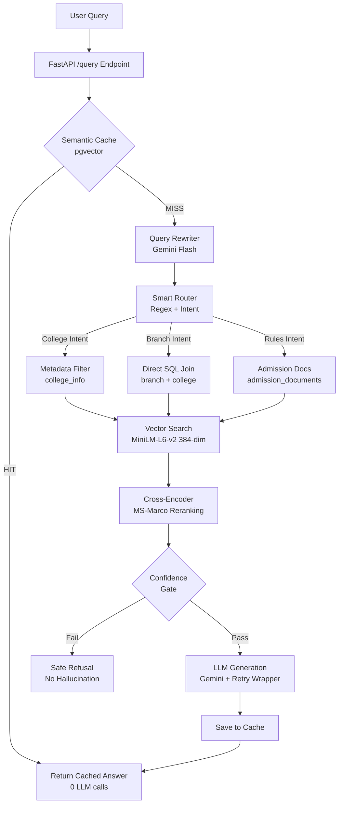

# 🎓 TNEA Counselor AI

> A **production-grade AI Engineering College Counselor** for Tamil Nadu students, powered by advanced **RAG (Retrieval-Augmented Generation)** with Hybrid Search, Conversational Memory, and Enterprise Guardrails.

Built to handle **418 Colleges**, **3,518 Branches**, and **Official TNEA Admission Rules** with zero hallucinations. Battle-tested against a **42-case edge-case regression suite** with **0 server failures**.


---

## 🚀 Key Features

- 🎯 **Smart Intent Routing** — Routes queries to College, Branch, or Admission data silos using strict Regex word boundaries (prevents "ec" matching "technology")
- 🔗 **Hybrid Search with SQL Joins** — Combines pgvector Vector Search + Relational SQL joins to enrich branch records with college names and districts
- 🔄 **Conversational Memory** — Multi-turn chat with history-aware query rewriting (resolves pronouns like "there", "it", "that college")
- 🔍 **Fuzzy Entity Matching** — Handles typos ("Colege"), abbreviations (SSN, PSG, CIT, CEG), and missing spaces via in-memory `difflib` resolution
- ⚡ **Semantic Caching** — Instant responses for repeated questions (0 LLM calls), with admin purge + user downvote self-healing
- 🛡️ **Anti-Hallucination Guardrails** — Confidence gates (Rerank logit + Vector similarity thresholds) block low-confidence generations before the LLM is called
- 🤖 **Universal Retry Wrapper** — Exponential backoff across a Gemini fallback chain survives 429 rate limits without crashing (0 HTTP 500s)
- 🧪 **42-Case Regression Suite** — Automated testing for SQL injection, Unicode/Tamil input, emoji, 3KB payloads, top_k bounds, filters, and concurrency bursts
- 👍 **User Feedback Loop** — "Thumbs Down" endpoint deletes poisoned cache entries on demand
- 🔧 **Admin Cache Management** — Secret-protected purge endpoint (403 on wrong key) for yearly data updates

---

## 🛠️ Tech Stack

| Component | Technology | Purpose |
|-----------|------------|---------|
| **Backend Framework** | FastAPI + Pydantic | Production REST API with request validation (`top_k` clamped 1–20) |
| **Vector Database** | Supabase + pgvector | 384-dim vector storage + `match_documents` RPC similarity search |
| **LLM** | Google Gemini Flash (fallback chain) | Answer generation, intent classification, query rewriting |
| **Embeddings** | `all-MiniLM-L6-v2` | 384-dim semantic vectors (optimized to fit 512MB free-tier RAM) |
| **Reranker** | `cross-encoder/ms-marco-MiniLM-L-6-v2` | Cross-Encoder relevance scoring + confidence gate |
| **Package Manager** | uv | Fast, reproducible installs |
| **Deployment** | Render (Free Tier) | Cloud hosting with CPU-only PyTorch build |

---

## 🏗️ System Architecture



---

## 📁 Project Structure

```text
RAG-final/
├── app/
│   ├── main.py                    # FastAPI app, CORS, lifespan preload, Admin & Feedback endpoints
│   ├── models.py                  # Pydantic schemas with top_k validator (1-20)
│   └── services/
│       ├── retrieval.py           # Hybrid Search, Fuzzy Matching, SQL Joins, Filter Normalizer
│       ├── llm.py                 # Gemini generation with fallback chain + retry wrapper
│       ├── query_understanding.py # Intent extraction + history-aware query rewriting
│       ├── memory.py              # Conversational history management
│       ├── semantic_cache.py      # pgvector semantic caching + guardrails
│       └── database.py            # Supabase client initialization
├── data/raw/                      # Source CSV and JSON datasets
├── scripts/
│   ├── 01_setup_supabase.sql      # Database schema + pgvector RPC functions (384-dim)
│   ├── 08_master_ingest.py        # Production ingestion pipeline
│   ├── 09_reingest_minilm.py      # Resume-safe re-ingestion with retry/backoff
│   ├── 06_verify_supabase.py      # Data health & integrity checker
│   └── 11_edge_case_tests.py      # 42-case automated regression suite
├── .env.example                   # Required environment variables
├── requirements.txt               # CPU-only PyTorch dependencies
├── Dockerfile                     # Container configuration (port 7860)
└── README.md                      # This file
```

---

## 🏃 Getting Started

### 1. Clone the Repository
```bash
git clone https://github.com/sudhakargovindasamy/tnea-ai-counselor.git
cd tnea-ai-counselor
```

### 2. Install Dependencies
```bash
# Install uv (fast Python package manager)
curl -LsSf https://astral.sh/uv/install.sh | sh

# Create virtual environment and install CPU-only dependencies
uv venv
source .venv/bin/activate   # Windows: .venv\Scripts\activate
uv pip install -r requirements.txt
```

### 3. Set Up Environment Variables
```bash
cp .env.example .env
nano .env
```

Required variables:
```env
SUPABASE_URL=https://your-project.supabase.co
SUPABASE_KEY=your-service-role-key
GEMINI_API_KEY=your-gemini-api-key
ADMIN_SECRET_KEY=your-custom-secret
```

### 4. Ingest Data to Supabase
```bash
# Upload 418 colleges, 3,518 branches, and 10 admission rule sets (384-dim vectors)
python scripts/08_master_ingest.py

# Verify data integrity
python scripts/06_verify_supabase.py
```

### 5. Run the API
```bash
uvicorn app.main:app --reload --port 8000
```

### 6. Access the API
- **Interactive Docs:** http://localhost:8000/docs
- **Health Check:** http://localhost:8000/health

---

## 📡 API Endpoints

| Method | Endpoint | Description |
|--------|----------|-------------|
| `GET`  | `/health` | System health check |
| `GET`  | `/` | HTML landing page with route links |
| `POST` | `/query` | Main RAG endpoint (`session_id`, `question`, `top_k`, `filters`) |
| `POST` | `/clear_chat/{session_id}` | Clear conversation history |
| `POST` | `/admin/purge_cache` | Wipe semantic cache (requires `admin_secret`, else 403) |
| `POST` | `/feedback/downvote` | Delete poisoned cache entry for a question |

### Example Query
```bash
curl -X POST "http://localhost:8000/query" \
  -H "Content-Type: application/json" \
  -d '{
    "session_id": "student_001",
    "question": "Which colleges in Coimbatore offer Computer Science?",
    "top_k": 5
  }'
```

### Example Response Shape
```json
{
  "answer": "The following colleges in Coimbatore offer Computer Science and Engineering...",
  "sources": [
    {
      "college_name": "PSG College of Technology",
      "tnea_code": "2744",
      "district": "Coimbatore",
      "score": 0.9123
    }
  ]
}
```

---

## 🧪 Testing & Quality Assurance

The system is protected by a **42-case automated regression suite** (`scripts/11_edge_case_tests.py`) that must pass with **0 FAIL** before every deployment.

```bash
# Terminal 1 — start server
uvicorn app.main:app --port 8000

# Terminal 2 — run suite (~10-15 min)
ADMIN_SECRET_KEY=your-secret python scripts/11_edge_case_tests.py
```

### Covered Edge Cases
- **Input Sanitization:** SQL injection payloads, 3KB questions, empty strings, whitespace, emoji, Tamil Unicode, multiline text
- **Validation:** `top_k` bounds enforced by Pydantic (0 / -5 / 100 → clean HTTP 422, never 500)
- **Retrieval Regression:** exact-value answers (mess bill ₹3,200), SQL-join enrichment, source-card completeness
- **Fuzzy Resolution:** typos ("Colege"), aliases ("SSN"), missing spaces ("PSGCollegeofTechnology")
- **Guardrails:** nonexistent colleges, Wi-Fi password requests, gibberish, future cutoffs → safe refusals
- **Memory:** pronoun resolution across turns, `clear_chat` wipe, 10-turn long history
- **Cache & Admin:** cache HIT path, downvote self-healing, wrong-secret 403 rejection
- **Filters:** district normalization (`COIMBATORE` → `Coimbatore`), NBA boolean→string mapping, district+branch intersection
- **Concurrency:** 6 parallel health checks + 3 parallel heavy queries

**Latest result: 42 cases | 34 PASS | 8 WARN (answer-wording reviews) | 0 FAIL ✅**

---

## ☁️ Deployment

### Render (Recommended — Free Tier)
The embedding model was deliberately sized (`all-MiniLM-L6-v2`, 384-dim, ~80MB) so the full stack fits inside Render's **512MB free-tier RAM** while keeping retrieval quality within ~1% of BGE-Large on this structured dataset.

| Setting | Value |
|---------|-------|
| **Runtime** | Python 3 |
| **Build Command** | `pip install -r requirements.txt` |
| **Start Command** | `uvicorn app.main:app --host 0.0.0.0 --port $PORT` |
| **Instance Type** | Free (512MB RAM) |
| **Region** | Singapore (lowest latency to India) |

Environment variables on Render: `SUPABASE_URL`, `SUPABASE_KEY`, `GEMINI_API_KEY`, `ADMIN_SECRET_KEY`.

> ⚠️ **Cold start note:** Free-tier instances sleep after 15 idle minutes. The first request after sleep takes ~30–45s to reload models; subsequent requests run in 2–6s. Show a "waking up" spinner in the UI for the first call.

### Docker
The included `Dockerfile` (CPU-only PyTorch, port 7860) supports any container host:
```bash
docker build -t tnea-counselor .
docker run -p 7860:7860 --env-file .env tnea-counselor
```

---

## 🤝 Team

This project was developed collaboratively during our internship, with each member owning specific components of the system.

| Member | Role | Key Contributions |
|--------|------|-------------------|
| **Sudhakar** | Backend & AI Architect | Complete RAG pipeline, FastAPI backend, Supabase pgvector integration, Hybrid SQL Joins, Fuzzy Entity Resolution, 42-case Regression Suite, Universal Retry Wrappers, Render deployment |
| **Kavivarshini** | AI/ML Engineer | RAG retrieval optimization, MiniLM embedding strategy, query understanding & intent classification, Cross-Encoder reranking, confidence scoring |
| **Poojitha** | Data Engineer | Data extraction from TNEA sources, document schema design, cleaning & normalization (418 colleges, 3,518 branches, 10 rule sets), CSV formatting |
| **Lekhana** | Frontend Developer | Chat UI, FastAPI integration, markdown rendering, source citation cards, session management, Google Auth integration |

---

### 👨‍💻 Detailed Individual Contributions

#### Sudhakar — Backend & AI Architect
- Architected the **complete FastAPI backend** with production-grade error handling, CORS, lifespan model preloading, and global exception handlers
- Designed **Hybrid Search** combining pgvector Vector Search + Direct SQL Relational Joins to enrich branch data with college metadata
- Built **Smart Intent Routing** with strict Regex word boundaries (prevents substring false-positives like "ec" in "technology")
- Implemented **Fuzzy Entity Resolution** using `difflib` + alias dictionaries to catch typos and abbreviations before vector search
- Developed **Semantic Caching** with pgvector similarity matching, admin purge, and downvote self-healing
- Engineered a **Universal Retry Wrapper** with exponential backoff so Gemini 429 rate limits degrade gracefully instead of crashing (0 HTTP 500s)
- Authored the **42-case automated regression suite** covering injection, Unicode, validation, filters, memory, and concurrency
- Configured **Pydantic validators** and a **metadata Filter Normalizer** to prevent context overflow and case/type mismatches

#### Kavivarshini — AI/ML Engineer
- Co-designed the **RAG retrieval strategy** with a hybrid (vector + SQL) approach
- Optimized the **embedding pipeline** using `all-MiniLM-L6-v2` (384 dimensions) to balance accuracy and memory footprint for free-tier cloud deployment
- Developed the **query understanding** module with Gemini for intent extraction and filter parsing
- Implemented **Cross-Encoder reranking** (MS-Marco) for improved retrieval precision
- Tuned **confidence thresholds** for the hallucination guardrail system

#### Poojitha — Data Engineer
- **Extracted** raw data from official TNEA brochures, PDFs, and source documents
- **Designed** document schemas for three data types: college profiles, branch details, admission rules
- **Cleaned and normalized** 418 colleges, 3,518 branches, and 10 admission rule sets
- **Converted** unstructured data into structured CSV and JSON formats
- Ensured consistent metadata tagging (`doc_type`, `tnea_code`, `district`, `branch_code`, `nba_accredited`) across all records

#### Lekhana — Frontend Developer
- Built the **modern Chat UI** with real-time response rendering
- Integrated the **FastAPI backend** (`/query`, `/clear_chat`, `/health`, `/feedback/downvote`)
- Implemented **Markdown rendering** for rich AI responses
- Designed **source citation cards** displaying college names, TNEA codes, and districts
- Added **session management** with conversation history persistence
- Integrated **Google OAuth** authentication via Supabase Auth

---

## 📊 Dataset Statistics

| Dataset | Records | Source |
|---------|---------|--------|
| College Profiles | 418 | TNEA Official List |
| Branch Details | 3,518 | AICTE + TNEA |
| Admission Rules | 10 | TNEA Information Brochure 2026 |
| **Total Documents** | **3,946** | Embedded in pgvector (384-dim) |

---

## 📄 License

This project is created for educational purposes as part of our internship program.

---

*Built with ❤️ for Tamil Nadu Engineering Students*